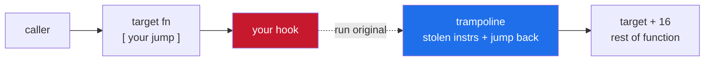
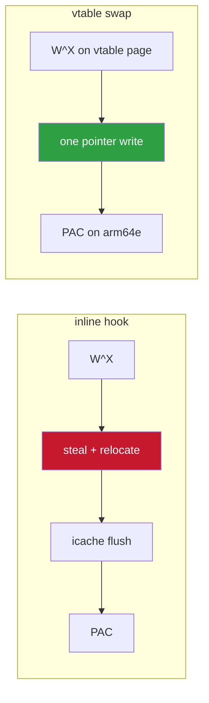
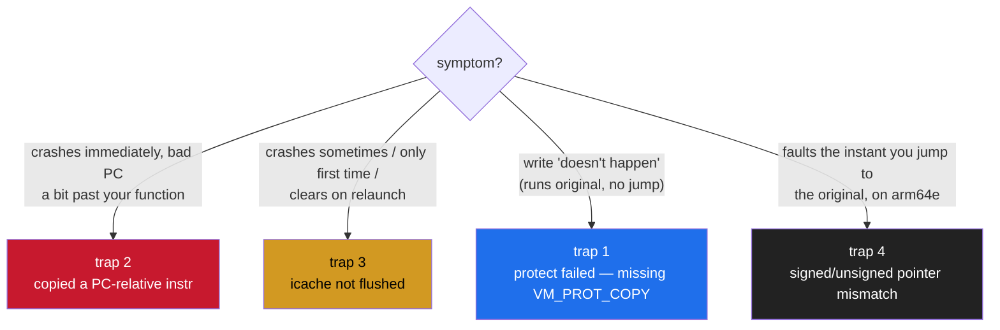

<h1 align="center">arm64-ios-inline-hook-notes</h1>

<p align="center">writing inline hooks on arm64 iOS by hand — and the four things that crash you if you get them wrong</p>

<p align="center">
  
  
  
  
</p>

---

Once you've found a function (`ProcessEvent`, a fire routine, whatever) you still
have to actually redirect it, and on Apple silicon that means dealing with **W^X**,
**instruction relocation**, the **icache**, and **pointer authentication**. Every one
of those bites — here's the whole thing in one place.

> This is the manual version. Frameworks exist and are great, but you should know
> what they're doing, because when a hook crashes on device you need to understand
> why.

---

## contents

- [the idea](#the-idea)
- [trap 1 — W^X](#trap-1--wx-you-cant-just-memcpy-over-code)
- [trap 2 — relocating the stolen instructions](#trap-2--relocating-the-stolen-instructions)
- [trap 3 — the instruction cache](#trap-3--the-instruction-cache)
- [trap 4 — pointer authentication (arm64e)](#trap-4--pointer-authentication-arm64e)
- [the safer alternative: vtable swap](#the-safer-alternative-when-you-can-use-it-vtable-swap)
- [putting it together](#putting-it-together)
- [how to tell which trap bit you](#how-to-tell-which-trap-bit-you)

---

## the idea

An inline hook overwrites the start of a function with a jump to your code. You save
the original bytes you clobbered ("stolen" instructions) into a small executable
buffer (the **trampoline**), followed by a jump back into the function past the patch.
Call the trampoline to run the original.

```
target:      [ your jump ][ rest of function... ]
trampoline:  [ stolen instrs relocated ][ jump to target+patchlen ]
```

On arm64 a far jump is:

```asm
LDR X17, #8       ; load the 64-bit target that follows
BR  X17
.quad target
```

16 bytes. So you steal at least 16 bytes (four instructions) from the function start.



---

## trap 1 — W^X, you can't just memcpy over code

iOS pages are **write XOR execute**. A code page is `r-x`; you cannot write to it as
is. You flip it, write, flip it back:

```c
// round to page, make it rwx, write, restore, flush
vm_address_t page = addr & ~(vm_page_size - 1);
vm_protect(mach_task_self(), page, size, false,
           VM_PROT_READ | VM_PROT_WRITE | VM_PROT_COPY);   // COPY matters, see below
memcpy((void*)addr, patch, patchlen);
vm_protect(mach_task_self(), page, size, false, VM_PROT_READ | VM_PROT_EXECUTE);
```

> [!IMPORTANT]
> `VM_PROT_COPY` in the first call is the bit people miss — it forces a private
> writable copy of a shared/clean page. Without it the `vm_protect` can fail on a
> mapped code page and your write silently doesn't take, or faults.

Your trampoline buffer also has to be made rwx (or allocated executable) or the jump
into it faults.

---

## trap 2 — relocating the stolen instructions

You can't just memcpy the stolen bytes into the trampoline and run them, because
arm64 has **PC-relative instructions**. If one of the instructions you stole computes
an address from PC (`ADR`, `ADRP`, `B`/`BL`, `LDR` literal, `CBZ`/`CBNZ`,
`TBZ`/`TBNZ`, `B.cond`), running it from the trampoline (a different PC) makes it
point somewhere wrong. Result: crash, or worse, silent corruption.

Two honest options:

1. **Refuse.** Check the first four instructions, and if any is PC-relative, don't
   install. A plain frame-setup prologue (`STP`, `SUB sp`, `MOV`) is position
   independent and copies verbatim, which covers a lot of functions. The safe, lazy,
   correct-when-it-applies choice.
2. **Relocate.** Actually fix up the PC-relative ones (recompute the `ADRP` page,
   re-encode the branch to an absolute jump). More work, more ways to get it subtly
   wrong. Only do this if you must hook a function whose prologue isn't clean.

Cheap prologue check in C:

```c
static bool prologue_is_copyable(uintptr_t a) {
    for (int i = 0; i < 4; i++) {
        uint32_t w = *(uint32_t*)(a + i*4);
        if ((w & 0x9F000000) == 0x90000000) return false;  // ADRP
        if ((w & 0x9F000000) == 0x10000000) return false;  // ADR
        if ((w & 0x7C000000) == 0x14000000) return false;  // B / BL
        if ((w & 0x7E000000) == 0x34000000) return false;  // CBZ/CBNZ
        if ((w & 0x7E000000) == 0x36000000) return false;  // TBZ/TBNZ
        if ((w & 0xFF000000) == 0x54000000) return false;  // B.cond
        if ((w & 0x3B000000) == 0x18000000) return false;  // LDR (literal)
    }
    return true;
}
```

---

## trap 3 — the instruction cache

You wrote new bytes into a code page. The CPU may still have the old bytes in its
**instruction cache**, so it executes stale code and you get a crash that makes no
sense because "the bytes are right when I look". Flush it:

```c
#include <libkern/OSCacheControl.h>
sys_icache_invalidate((void*)addr, patchlen);
sys_icache_invalidate(trampoline, tramp_len);
```

Do this for **both** the patched site and the trampoline, after writing, before
anyone runs them.

> [!WARNING]
> Skipping this is the single most confusing bug in the whole process because it's
> **nondeterministic** — the crash comes and goes.

---

## trap 4 — pointer authentication (arm64e)

Check the Mach-O `cpusubtype` (offset 8). Value `0` is plain arm64; value `2` is
arm64e with **PAC** on. On arm64e:

- pointers you read out of vtables and some function pointers are **signed**. A raw
  `BR` to a signed pointer faults — strip/auth it before you use it.
- your own hook function pointer is a plain address as a raw immediate in the
  `.quad`, that's fine — but if you're pulling the original out of a signed vtable
  slot to build your trampoline jump, strip it first.

> [!NOTE]
> A lot of current App Store binaries still ship a plain arm64 slice even on arm64e
> hardware, so PAC often isn't in play. **Check per binary, don't assume either way.**

---

## the safer alternative when you can use it: vtable swap

If what you're hooking is a **virtual** (and in UE-style code a lot is), skip inline
hooking entirely. Overwrite the vtable slot with your function pointer, keep the
original to forward. One pointer write — no stolen instructions, no relocation, no
prologue check.



You still deal with W^X on the vtable page and PAC on arm64e, but you dodge the two
nastiest traps (relocation and icache). Reach for inline hooks only when there's no
vtable slot to take.

---

## putting it together

```c
bool install_inline(uintptr_t fn, void* hook, uint32_t* tramp, void** orig) {
    if (!prologue_is_copyable(fn)) return false;         // trap 2: refuse dirty prologues

    memcpy(tramp, (void*)fn, 16);                        // steal 4 instrs
    emit_abs_jump(&tramp[4], fn + 16);                   // + jump back
    make_rwx(tramp, 64); sys_icache_invalidate(tramp, 64);
    *orig = tramp;

    uint32_t patch[4]; emit_abs_jump(patch, (uintptr_t)hook);
    if (!protect_rwx(fn, 16)) return false;              // trap 1: W^X (+VM_PROT_COPY)
    memcpy((void*)fn, patch, 16);
    protect_rx(fn, 16);
    sys_icache_invalidate((void*)fn, 16);                // trap 3: flush
    return true;
}
```

`emit_abs_jump` writes the `LDR X17,#8` / `BR X17` / `.quad target` sequence.

---

## how to tell which trap bit you



| symptom | trap | fix |
|---------|------|-----|
| crashes immediately, bad PC that looks like a real code address a bit past your function | **2** | you copied a PC-relative instruction — refuse or relocate it |
| crashes sometimes / only the first time / clears on relaunch | **3** | icache — flush both sites after writing |
| your write "doesn't happen" (function runs original, no jump) | **1** | `vm_protect` failed, usually the missing `VM_PROT_COPY` |
| fault the instant you jump to the original, on arm64e | **4** | unsigned/signed pointer mismatch — strip/auth the PAC pointer |

Match the symptom to the trap and you'll fix it in minutes instead of hours.

---

<p align="center">— shiedless</p>
